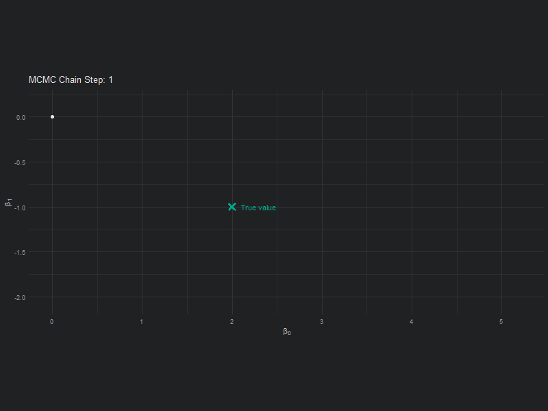
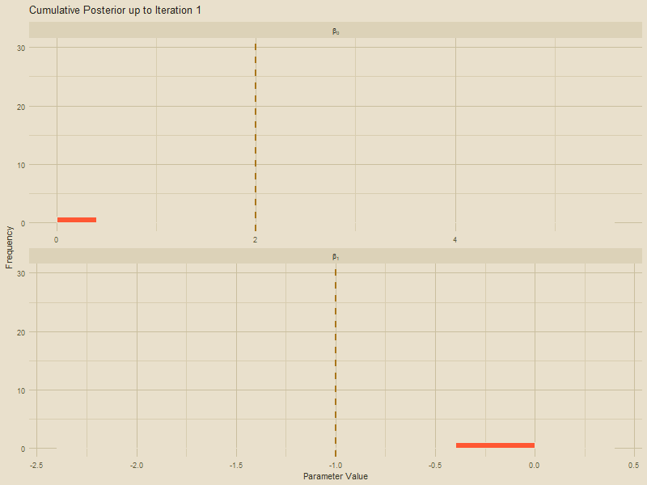
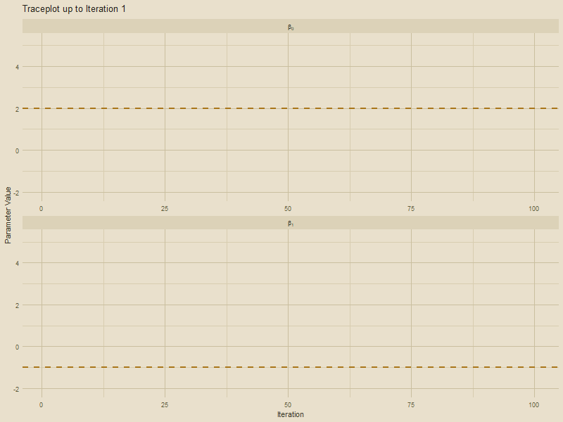
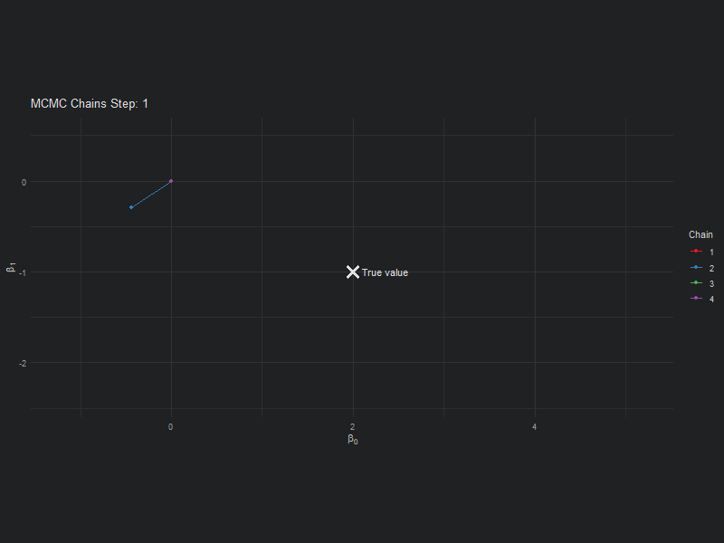
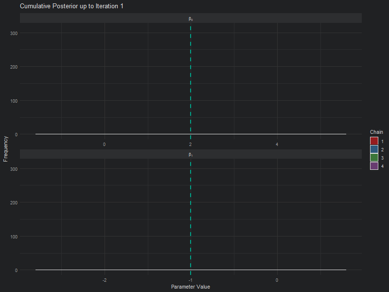
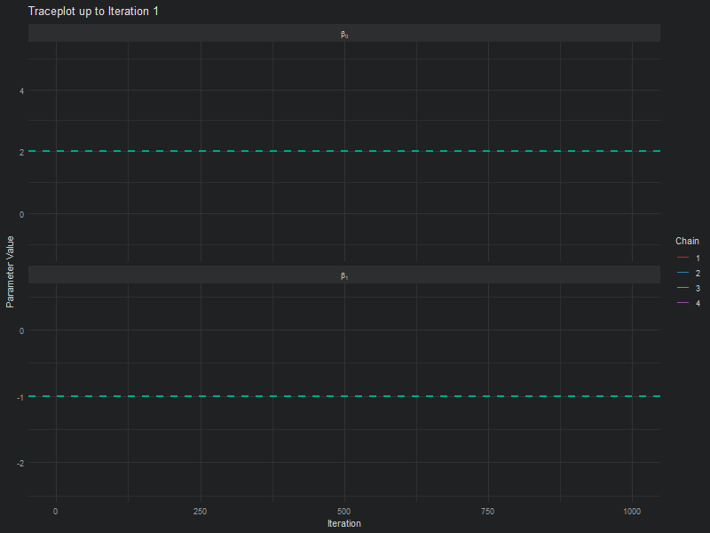

```{r setup, include=FALSE}
knitr::opts_chunk$set(echo = TRUE, warning = FALSE, message = FALSE,
                      dev.args = list(bg = "#202123"))

theme_dark_site <- function(...) {
  ggplot2::theme_minimal(...) +
  ggplot2::theme(
    plot.background   = ggplot2::element_rect(fill = "#202123", colour = NA),
    panel.background  = ggplot2::element_rect(fill = "#202123", colour = NA),
    panel.grid.major  = ggplot2::element_line(colour = "#333333"),
    panel.grid.minor  = ggplot2::element_line(colour = "#2d2e30"),
    text              = ggplot2::element_text(colour = "#cccccc"),
    axis.text         = ggplot2::element_text(colour = "#999999"),
    plot.title        = ggplot2::element_text(colour = "#ffffff", face = "bold"),
    plot.subtitle     = ggplot2::element_text(colour = "#999999"),
    plot.caption      = ggplot2::element_text(colour = "#666666"),
    legend.background = ggplot2::element_rect(fill = "#202123", colour = NA),
    legend.key        = ggplot2::element_rect(fill = "#202123", colour = NA),
    legend.text       = ggplot2::element_text(colour = "#cccccc"),
    legend.title      = ggplot2::element_text(colour = "#cccccc"),
    strip.background  = ggplot2::element_rect(fill = "#2d2e30", colour = NA),
    strip.text        = ggplot2::element_text(colour = "#cccccc")
  )
}
```

In the previous page, we went through the underlying theory of Bayesian statistics; how our prior knowledge is updated using real data through Bayes’ Theorem. Now, we're going to move into the practical application of these ideas using the `spOccupancy` package. My goal here is to help you understand how Bayesian occupancy models are fit, how to monitor convergence, and how to interpret uncertainty through credible intervals.

We'll again work with the Etosha elephant dataset. Importantly, we are not yet including spatial autocorrelation. We'll add that in the next section.

```{r, message = FALSE, warning = FALSE}
library(spOccupancy)

# These are needed to produce the website
library(tidyverse)
library(gganimate)
library(ggthemes)
```

```{r, include=FALSE}
set.seed(1234)
dat <- simOcc(J.x = 8, 
              J.y = 8, 
              n.rep = rep(3, times = 8 * 8), 
              beta = c(1, -0.2, 0.3), 
              alpha = c(-2, 0.5))
obs <- dat$y
temp <- dat$X[,2]
tree <- dat$X[,3]
det_cov <- dat$X.p[,,2]

det.covs <- list(rain = dat$X.p[,,2])
occ.covs <- data.frame(tree = tree, temp = temp)
etosha <- list(
  y = dat$y,
  det.covs = det.covs,
  occ.covs = occ.covs
)
```

# How do we estimate a posterior?

In the previous page we spoke about posteriors and how these are a combination of our prior belief and our data. But how does that *actually* happen? Well, the answer is pretty simple but took hundreds of years for statisticians to figure out. Markov Chain Monte Carlo is an algorithm that was developed by scientists at Los Alamos in the 1950s working on the Manhattan Project (yes *that* Manhattan Project). The algorithm is called Markov Chain Monte Carlo (or MCMC) for two reasons. A Markov Chain describes a sequence of states, where the probability to move from one state to the next state depends only on what the current state is.

For example, imagine you are walking through a series of rooms. Where you go next depends only on the room you're currently in. You can't instantly teleport to the other side of the building! Nor does it depend on the path you have taken to get to your current room.

# What does MCMC look like?

Below is an animation of a simple MCMC algorithm to help give an intuition for what's happening behind the scenes.

For this, we have the following simple linear model:

$$y_i \sim Normal(\mu_i, \sigma^2)$$

$$\mu_i = \beta_0 + \beta_1 \times x_i $$

So our objective here is to figure out $\beta_0$ and $\beta_1$. To do so, we'll set up an MCMC using one "chain". A chain is a Markov Chain - it's the black dot and orange line you can see in the animation below. This chain is trying to find the "True value" location marked with a teal X. At each step the black dot asks "if I take a step in a random direction, will I be closer to X or further away?". If it's closer, then it takes the step. If it's further away, then it's *less* likely to take the step but it's not impossible. This seems like a bad choice. Why move somewhere if it's further away from X? The answer is a bit nuanced, but the concise explanation is that sometimes there might be areas of the "parameter space" (the parameter space is all possible values of $\beta_0$ and $\beta_1$) which work quite well despite not being the true value. If we didn't have the behaviour, where the chain might take a step even though it's worse, then we might get stuck in one of these "bad" areas (technically, these "bad" areas are called *local minima*).

Here's our MCMC in action:

```{r, message = FALSE, warning = FALSE, eval = F}
true_param <- c(2, -1)
target_density <- function(x, y) {
  exp(-0.5 * ((x - true_param[1])^2 / 1^2 + (y - true_param[2])^2 / 0.5^2))
}

set.seed(123)
n_iter <- 100
x <- y <- 0
samples <- tibble(x = x, y = y, iteration = 1)

for (i in 2:n_iter) {
  x_prop <- rnorm(1, x, 0.4)
  y_prop <- rnorm(1, y, 0.4)
  accept_ratio <- target_density(x_prop, y_prop) / target_density(x, y)
  
  if (runif(1) < accept_ratio) {
    x <- x_prop
    y <- y_prop
  }
  samples <- samples |> add_row(x = x, y = y, iteration = i)
}

ggplot(samples, aes(x = x, y = y)) +
  geom_path(color = "#FF5733", linewidth = 0.7) +
  geom_point(aes(x = x, y = y), color = "black", size = 2) +
  geom_point(aes(x = true_param[1], y = true_param[2]), 
             color = "#00A68A", size = 3, shape = 4, stroke = 2) +
  annotate("text", x = true_param[1] + 0.1, y = true_param[2],
           label = "True value", color = "#00A68A", hjust = 0) +
  transition_reveal(iteration) +
  coord_fixed() +
  labs(
    title = "MCMC Chain Step: {frame_along}",
    x = bquote(beta[0]),
    y = bquote(beta[1])
  ) +
  theme_dark_site()
```

<div style="text-align: center;">
  {width=800}
</div>

Here's where the really clever bit comes in. At each iteration, if we record the parameter value it tried, and store it, when we build it up the end result is our *posterior*! This is what made Bayesian statistics possible! We don't need to use any crazy (and often impossible) maths to figure out the posterior, we just have MCMC walk around and the end result is an insanely good reflection of the posterior!

```{r, message = FALSE, warning = FALSE, eval = F}
samples_long <- samples |>
  pivot_longer(cols = c(x, y), names_to = "parameter", values_to = "value")

samples_long <- samples_long |>
  mutate(true_value = if_else(parameter == "x", true_param[1], true_param[2]))

samples_long_cumulative <- samples_long |>
  group_by(parameter) |>
  group_split() |>
  map_dfr(function(df) {
    param <- unique(df$parameter)
    map_dfr(1:max(df$iteration), function(i) {
      df |>
        filter(iteration <= i) |>
        mutate(frame = i, parameter = param)
    })
  })

samples_long_cumulative <- samples_long_cumulative %>%
  mutate(parameter_label = case_when(
    parameter == "x" ~ "beta[0]",
    parameter == "y" ~ "beta[1]"
  ))

ggplot(samples_long_cumulative, aes(x = value)) +
  geom_histogram(binwidth = 0.4, fill = "#FF5733", color = "white", boundary = 0) +
  geom_vline(aes(xintercept = true_value), linetype = "dashed", color = "#00A68A", linewidth = 1) +
  facet_wrap(~parameter_label, scales = "free_x", ncol = 1, labeller = label_parsed) +
  transition_manual(frame) +
  labs(title = "Cumulative Posterior up to Iteration {current_frame}",
       x = "Parameter Value", y = "Frequency") +
  theme_dark_site()
```

<div style="text-align: center;">
  {width=800}
</div>

Another way to show what the MCMC was up to is using something called "traceplots". These are relatively simple but actually quite powerful for determining if we *trust* the model output. We'll come back to this in a bit, but for now, we can show the MCMC exploring the parameter space using these traceplots.

```{r, message = FALSE, warning = FALSE, eval = F}
samples_long_cumulative_trace <- samples_long |>
  group_by(parameter) |>
  group_split() |>
  map_dfr(function(df) {
    param <- unique(df$parameter)
    map_dfr(1:max(df$iteration), function(i) {
      df |>
        filter(iteration <= i) |>
        mutate(frame = i, parameter = param)
    })
  })

samples_long_cumulative_trace <- samples_long_cumulative_trace %>%
  mutate(parameter_label = case_when(
    parameter == "x" ~ "beta[0]",
    parameter == "y" ~ "beta[1]"
  ))

ggplot(samples_long_cumulative_trace, aes(x = iteration, y = value)) +
  geom_line(color = "#FF5733", linewidth = 0.8) +
  geom_hline(aes(yintercept = true_value), linetype = "dashed", color = "#00A68A", linewidth = 1) +
  facet_wrap(~parameter_label, scales = "free_x", ncol = 1, labeller = label_parsed) +
  transition_manual(frame) +
  labs(title = "Traceplot up to Iteration {current_frame}",
       x = "Iteration", y = "Parameter Value") +
  theme_dark_site()

```

<div style="text-align: center;">
  {width=800}
</div>

# Try it yourself

The animations above show what MCMC looks like when it works well. Now try it yourself. Click anywhere on the parameter space below to place a sample. After your first click, each new click will tell you whether you moved to a higher likelihood (hotter) or lower likelihood (colder). Your samples accumulate in the histograms and trace plots below. The likelihood surface is hidden until you run out of iterations.

```{=html}
<div id="mw-wrap" style="background:#202123;padding:20px;border-radius:6px;margin:20px 0;font-family:sans-serif;">

  <div style="display:flex;align-items:center;gap:8px;margin-bottom:16px;">
    <span style="color:#999;font-size:12px;">Iterations:</span>
    <button id="mw-i25"  style="background:none;border:1px solid #555;color:#999;padding:4px 12px;border-radius:4px;cursor:pointer;font-size:12px;">25</button>
    <button id="mw-i50"  style="background:none;border:1px solid #555;color:#999;padding:4px 12px;border-radius:4px;cursor:pointer;font-size:12px;">50</button>
    <button id="mw-i100" style="background:none;border:1px solid #555;color:#999;padding:4px 12px;border-radius:4px;cursor:pointer;font-size:12px;">100</button>
  </div>

  <div style="display:flex;gap:24px;flex-wrap:wrap;align-items:flex-start;">

    <div style="flex-shrink:0;">
      <canvas id="mw-canvas" width="380" height="380"
        style="border:1px solid #444;cursor:crosshair;display:block;border-radius:4px;"></canvas>
    </div>

    <div style="flex:1;min-width:180px;color:#cccccc;">
      <div id="mw-iter" style="font-size:13px;color:#999;height:20px;margin-bottom:10px;"></div>
      <div style="height:62px;border:1px solid #2d2d2f;border-radius:4px;padding:10px 12px;margin-bottom:14px;box-sizing:border-box;overflow:hidden;">
        <div id="mw-feedback" style="font-size:16px;font-weight:bold;height:22px;overflow:hidden;"></div>
        <div id="mw-like"     style="font-size:12px;color:#999;margin-top:4px;height:16px;overflow:hidden;"></div>
      </div>
      <button id="mw-reset" style="background:none;border:1px solid #555;color:#999;padding:6px 14px;border-radius:4px;cursor:pointer;font-size:12px;">Reset</button>
      <div id="mw-result" style="display:none;border:1px solid #00a68a;border-radius:4px;padding:12px;font-size:13px;margin-top:12px;"></div>
    </div>

  </div>

  <div style="display:flex;gap:16px;margin-top:16px;flex-wrap:wrap;">
    <div style="flex:1;min-width:180px;">
      <div style="color:#999;font-size:12px;margin-bottom:3px;">Samples of β₀</div>
      <canvas id="mw-hb0" width="320" height="80"
        style="border:1px solid #444;display:block;width:100%;border-radius:4px;"></canvas>
      <div style="color:#999;font-size:12px;margin-top:8px;margin-bottom:3px;">Trace of β₀</div>
      <canvas id="mw-tb0" width="320" height="60"
        style="border:1px solid #444;display:block;width:100%;border-radius:4px;"></canvas>
    </div>
    <div style="flex:1;min-width:180px;">
      <div style="color:#999;font-size:12px;margin-bottom:3px;">Samples of β₁</div>
      <canvas id="mw-hb1" width="320" height="80"
        style="border:1px solid #444;display:block;width:100%;border-radius:4px;"></canvas>
      <div style="color:#999;font-size:12px;margin-top:8px;margin-bottom:3px;">Trace of β₁</div>
      <canvas id="mw-tb1" width="320" height="60"
        style="border:1px solid #444;display:block;width:100%;border-radius:4px;"></canvas>
    </div>
  </div>

</div>

<script>
(function () {
  var B0MIN = -2, B0MAX = 6, B1MIN = -3, B1MAX = 1;
  var MAXITER = 25;
  var BG = "#202123", TEAL = "#00a68a", ORANGE = "#FF5733";
  var LM_B0 = -0.5, LM_B1 = -1.5;

  var TB0, TB1;
  var samples = [], done = false;

  var cv    = document.getElementById("mw-canvas");
  var ctx   = cv.getContext("2d");
  var cx0   = document.getElementById("mw-hb0").getContext("2d");
  var cx1   = document.getElementById("mw-hb1").getContext("2d");
  var tx0   = document.getElementById("mw-tb0").getContext("2d");
  var tx1   = document.getElementById("mw-tb1").getContext("2d");
  var elIt  = document.getElementById("mw-iter");
  var elFb  = document.getElementById("mw-feedback");
  var elLk  = document.getElementById("mw-like");
  var elRs  = document.getElementById("mw-result");
  var elBtn = document.getElementById("mw-reset");
  var elI25  = document.getElementById("mw-i25");
  var elI50  = document.getElementById("mw-i50");
  var elI100 = document.getElementById("mw-i100");

  function randTrue() {
    do {
      TB0 = Math.round((-1   + Math.random() * 6) * 10) / 10;
      TB1 = Math.round((-2.5 + Math.random() * 3) * 10) / 10;
    } while (Math.sqrt(Math.pow(TB0 - LM_B0, 2) + Math.pow(TB1 - LM_B1, 2)) < 2.5);
  }

  function lhood(b0, b1) {
    var main  = Math.exp(-0.5 * (Math.pow(b0 - TB0,  2) / 1.0  + Math.pow(b1 - TB1,  2) / 0.25));
    var local = 0.45 * Math.exp(-0.5 * (Math.pow(b0 - LM_B0, 2) / 0.6 + Math.pow(b1 - LM_B1, 2) / 0.15));
    return main + local;
  }

  function toParam(px, py) {
    return { b0: B0MIN + (px / cv.width)  * (B0MAX - B0MIN),
             b1: B1MAX - (py / cv.height) * (B1MAX - B1MIN) };
  }

  function toXY(b0, b1) {
    return { x: (b0 - B0MIN) / (B0MAX - B0MIN) * cv.width,
             y: (B1MAX - b1) / (B1MAX - B1MIN) * cv.height };
  }

  function drawSurface() {
    var id = ctx.createImageData(cv.width, cv.height);
    for (var px = 0; px < cv.width; px++) {
      for (var py = 0; py < cv.height; py++) {
        var p = toParam(px, py), l = lhood(p.b0, p.b1);
        var i = (py * cv.width + px) * 4;
        id.data[i]   = Math.round(l * 42);
        id.data[i+1] = Math.round(35 + l * 133);
        id.data[i+2] = Math.round(40 + l * 98);
        id.data[i+3] = Math.round(55 + l * 160);
      }
    }
    ctx.putImageData(id, 0, 0);
  }

  function drawGrid() {
    var o = toXY(0, 0);
    ctx.strokeStyle = "#2d2d2f"; ctx.lineWidth = 0.5;
    ctx.beginPath(); ctx.moveTo(o.x, 0);   ctx.lineTo(o.x, cv.height); ctx.stroke();
    ctx.beginPath(); ctx.moveTo(0, o.y);   ctx.lineTo(cv.width, o.y);  ctx.stroke();
    ctx.fillStyle = "#555"; ctx.font = "11px sans-serif"; ctx.textAlign = "center";
    ctx.fillText("β₀", cv.width / 2, cv.height - 4);
    ctx.save(); ctx.translate(10, cv.height / 2); ctx.rotate(-Math.PI / 2);
    ctx.fillText("β₁", 0, 0); ctx.restore();
    ctx.font = "9px sans-serif"; ctx.fillStyle = "#555";
    ctx.textAlign = "left";  ctx.fillText(B0MIN, 14, cv.height - 4);
    ctx.textAlign = "right"; ctx.fillText(B0MAX, cv.width - 2, cv.height - 4);
    ctx.textAlign = "right"; ctx.fillText(B1MAX, cv.width - 2, 10);
    ctx.textAlign = "right"; ctx.fillText(B1MIN, cv.width - 2, cv.height - 14);
  }

  function drawTrueMark() {
    var p = toXY(TB0, TB1), r = 7;
    ctx.strokeStyle = "#ffffff"; ctx.lineWidth = 2;
    ctx.beginPath(); ctx.moveTo(p.x-r, p.y-r); ctx.lineTo(p.x+r, p.y+r); ctx.stroke();
    ctx.beginPath(); ctx.moveTo(p.x+r, p.y-r); ctx.lineTo(p.x-r, p.y+r); ctx.stroke();
    ctx.fillStyle = "#ffffff"; ctx.font = "11px sans-serif"; ctx.textAlign = "left";
    ctx.fillText("True value", p.x + r + 4, p.y + 4);
  }

  function drawSamples() {
    if (samples.length > 1) {
      ctx.strokeStyle = ORANGE; ctx.lineWidth = 1.2; ctx.setLineDash([3, 3]);
      ctx.beginPath();
      var s0 = toXY(samples[0].b0, samples[0].b1); ctx.moveTo(s0.x, s0.y);
      for (var i = 1; i < samples.length; i++) {
        var si = toXY(samples[i].b0, samples[i].b1); ctx.lineTo(si.x, si.y);
      }
      ctx.stroke(); ctx.setLineDash([]);
    }
    for (var j = 0; j < samples.length; j++) {
      var last = j === samples.length - 1;
      var p = toXY(samples[j].b0, samples[j].b1);
      ctx.beginPath(); ctx.arc(p.x, p.y, last ? 5 : 3, 0, Math.PI * 2);
      ctx.fillStyle = last ? TEAL : ORANGE; ctx.fill();
    }
  }

  function redraw(reveal) {
    ctx.fillStyle = BG; ctx.fillRect(0, 0, cv.width, cv.height);
    if (reveal) drawSurface();
    drawGrid(); drawSamples();
    if (reveal) drawTrueMark();
  }

  function drawHist(hctx, vals, xmin, xmax) {
    var w = hctx.canvas.width, h = hctx.canvas.height, N = 20, pad = 14;
    var bins = new Array(N).fill(0);
    vals.forEach(function(v) {
      bins[Math.max(0, Math.min(N-1, Math.floor((v - xmin) / (xmax - xmin) * N)))]++;
    });
    var maxB = Math.max.apply(null, bins.concat([1]));
    hctx.fillStyle = BG; hctx.fillRect(0, 0, w, h);
    var bw = w / N; hctx.fillStyle = TEAL;
    for (var i = 0; i < N; i++) {
      var bh = (bins[i] / maxB) * (h - pad);
      hctx.fillRect(i * bw + 1, h - pad - bh, bw - 2, bh);
    }
    if (vals.length > 0) {
      var mean = vals.reduce(function(a, b) { return a + b; }, 0) / vals.length;
      var mx = (mean - xmin) / (xmax - xmin) * w;
      hctx.strokeStyle = "#ffffff"; hctx.lineWidth = 1.5; hctx.setLineDash([3, 3]);
      hctx.beginPath(); hctx.moveTo(mx, 0); hctx.lineTo(mx, h - pad);
      hctx.stroke(); hctx.setLineDash([]);
    }
    hctx.fillStyle = "#555"; hctx.font = "9px sans-serif";
    hctx.textAlign = "left";  hctx.fillText(xmin, 2, h - 2);
    hctx.textAlign = "right"; hctx.fillText(xmax, w - 2, h - 2);
  }

  function drawTrace(hctx, vals, ymin, ymax) {
    var w = hctx.canvas.width, h = hctx.canvas.height, pad = 14;
    hctx.fillStyle = BG; hctx.fillRect(0, 0, w, h);
    hctx.fillStyle = "#555"; hctx.font = "9px sans-serif";
    hctx.textAlign = "left";  hctx.fillText(ymin, 2, h - 2);
    hctx.textAlign = "right"; hctx.fillText(ymax, w - 2, h - 2);
    if (vals.length < 2) return;
    hctx.strokeStyle = TEAL; hctx.lineWidth = 1.2; hctx.setLineDash([]);
    hctx.beginPath();
    for (var i = 0; i < vals.length; i++) {
      var x = (i / (MAXITER - 1)) * w;
      var y = (h - pad) - Math.max(0, Math.min(1, (vals[i] - ymin) / (ymax - ymin))) * (h - pad);
      if (i === 0) hctx.moveTo(x, y); else hctx.lineTo(x, y);
    }
    hctx.stroke();
  }

  function quantile(arr, q) {
    var sorted = arr.slice().sort(function(a, b) { return a - b; });
    var pos = (sorted.length - 1) * q, base = Math.floor(pos), rest = pos - base;
    return sorted[base + 1] !== undefined
      ? sorted[base] + rest * (sorted[base + 1] - sorted[base])
      : sorted[base];
  }

  function lockIter(locked) {
    [elI25, elI50, elI100].forEach(function(b) {
      b.disabled = locked;
      b.style.opacity = locked ? "0.4" : "1";
      b.style.cursor  = locked ? "not-allowed" : "pointer";
    });
  }

  function setIter(n) {
    MAXITER = n;
    [elI25, elI50, elI100].forEach(function(b, i) {
      var v = [25, 50, 100][i];
      b.style.borderColor = (v === n) ? TEAL : "#555";
      b.style.color       = (v === n) ? TEAL : "#999";
    });
    reset();
  }

  cv.addEventListener("click", function(e) {
    if (done) return;
    var rect = cv.getBoundingClientRect();
    var sx = cv.width / rect.width, sy = cv.height / rect.height;
    var p = toParam((e.clientX - rect.left) * sx, (e.clientY - rect.top) * sy);
    var l = lhood(p.b0, p.b1);
    var n = samples.length;
    samples.push({ b0: p.b0, b1: p.b1, l: l });

    if (n === 0) {
      lockIter(true);
      elFb.style.color = "#999"; elFb.textContent = "First sample placed.";
    } else {
      var prev = samples[n - 1];
      if      (l > prev.l) { elFb.style.color = TEAL;      elFb.textContent = "Hotter"; }
      else if (l < prev.l) { elFb.style.color = "#e05555"; elFb.textContent = "Colder"; }
      else                 { elFb.style.color = "#999";    elFb.textContent = "Same likelihood"; }
    }
    elLk.textContent = "Likelihood: " + l.toFixed(5);

    var b0vals = samples.map(function(s) { return s.b0; });
    var b1vals = samples.map(function(s) { return s.b1; });
    redraw(false);
    drawHist(cx0, b0vals, B0MIN, B0MAX); drawHist(cx1, b1vals, B1MIN, B1MAX);
    drawTrace(tx0, b0vals, B0MIN, B0MAX); drawTrace(tx1, b1vals, B1MIN, B1MAX);

    var rem = MAXITER - samples.length;
    elIt.textContent = rem > 0 ? rem + " iteration" + (rem === 1 ? "" : "s") + " remaining" : "";

    if (samples.length >= MAXITER) {
      done = true; cv.style.cursor = "default"; lockIter(false);
      redraw(true);

      var mb0 = b0vals.reduce(function(a, b) { return a + b; }, 0) / MAXITER;
      var mb1 = b1vals.reduce(function(a, b) { return a + b; }, 0) / MAXITER;
      var b0lo = quantile(b0vals, 0.025), b0hi = quantile(b0vals, 0.975);
      var b1lo = quantile(b1vals, 0.025), b1hi = quantile(b1vals, 0.975);
      var b0captured = TB0 >= b0lo && TB0 <= b0hi;
      var b1captured = TB1 >= b1lo && TB1 <= b1hi;
      var distTrue  = Math.sqrt(Math.pow(mb0 - TB0,  2) + Math.pow(mb1 - TB1,  2));
      var distLocal = Math.sqrt(Math.pow(mb0 - LM_B0, 2) + Math.pow(mb1 - LM_B1, 2));
      var stuck = distLocal < distTrue;

      var tick  = "<span style='color:" + TEAL    + ";'>&#10003;</span>";
      var cross = "<span style='color:#e05555;'>&#10007;</span>";
      var summary = "";
      if (stuck) {
        summary = "<div style='margin-top:10px;padding:8px;background:#2d1f1f;border-radius:4px;color:#e05555;font-size:12px;'>" +
          "Your posterior mean is near the local minimum at (β₀ = " + LM_B0 + ", β₁ = " + LM_B1 + "). " +
          "The hot/cold feedback led you toward a plausible but wrong region. " +
          "This is exactly why real MCMC occasionally accepts worse moves: to escape traps like this." +
          "</div>";
      } else if (b0captured && b1captured) {
        summary = "<div style='margin-top:10px;padding:8px;background:#1a2d26;border-radius:4px;color:" + TEAL + ";font-size:12px;'>" +
          "Your credible intervals captured both true values. Good exploration." + "</div>";
      } else {
        summary = "<div style='margin-top:10px;padding:8px;background:#2a2a1f;border-radius:4px;color:#ccaa44;font-size:12px;'>" +
          "You found the right region but your intervals missed one or both true values. " +
          "More iterations and more systematic exploration would help." + "</div>";
      }

      elRs.style.display = "block";
      elRs.innerHTML =
        "<div style='color:#cccccc;font-weight:bold;margin-bottom:8px;'>Your posterior means</div>" +
        "<div style='color:" + TEAL + ";'>β₀ = " + mb0.toFixed(2) +
          " &nbsp; 95% CI: [" + b0lo.toFixed(2) + ", " + b0hi.toFixed(2) + "] &nbsp;" + (b0captured ? tick : cross) + "</div>" +
        "<div style='color:" + TEAL + ";margin-bottom:6px;'>β₁ = " + mb1.toFixed(2) +
          " &nbsp; 95% CI: [" + b1lo.toFixed(2) + ", " + b1hi.toFixed(2) + "] &nbsp;" + (b1captured ? tick : cross) + "</div>" +
        "<div style='color:#666;font-size:11px;'>True values: β₀ = " + TB0 + ", β₁ = " + TB1 + "</div>" +
        summary;

      elFb.style.color = "#cccccc"; elFb.textContent = "Done. Surface revealed.";
      elLk.textContent = "";
    }
  });

  function reset() {
    randTrue(); samples = []; done = false;
    cv.style.cursor = "crosshair"; lockIter(false);
    elFb.textContent = ""; elLk.textContent = "";
    elRs.style.display = "none"; elRs.innerHTML = "";
    redraw(false);
    drawHist(cx0, [], B0MIN, B0MAX); drawHist(cx1, [], B1MIN, B1MAX);
    drawTrace(tx0, [], B0MIN, B0MAX); drawTrace(tx1, [], B1MIN, B1MAX);
    elIt.textContent = MAXITER + " iterations available. Click to place your first sample.";
  }

  elBtn.addEventListener("click", reset);
  elI25.addEventListener("click",  function() { setIter(25);  });
  elI50.addEventListener("click",  function() { setIter(50);  });
  elI100.addEventListener("click", function() { setIter(100); });

  setIter(25);
})();
</script>
```

# Improving our MCMC

We've made a good start but we can improve this quite a bit. Firstly, limiting the algorithm to 25 or even 100 iterations doesn't give it many opportunities to find the true value. In general, you often give MCMC thousands of iterations, rather than only 100. So first improvement is to increase the number of iterations (you may remember we did this when we were going through the occupancy theory pages - now you know why!).

Secondly, we're using one MCMC chain. Why not more? Afterall, if we have say four chains, then if all four agree that they're close to the true value that would give us more comfort. If they find different "True values", well, then it seems likely that we haven't actually found it.

Let's implement our improvement and see what our plots now look like:

```{r, message = FALSE, warning = FALSE, eval = F}
true_param <- c(2, -1)

target_density <- function(x, y) {
  exp(-0.5 * ((x - true_param[1])^2 / 1^2 + (y - true_param[2])^2 / 0.5^2))
}

set.seed(123)
n_iter <- 1000
n_chains <- 4

chains_list <- map_dfr(1:n_chains, function(chain_id) {
  x <- y <- 0  # Start at (0, 0)
  samples <- tibble(x = x, y = y, iteration = 1, chain = chain_id)
  
  for (i in 2:n_iter) {
    x_prop <- rnorm(1, x, 0.4)
    y_prop <- rnorm(1, y, 0.4)
    accept_ratio <- target_density(x_prop, y_prop) / target_density(x, y)
    
    if (runif(1) < accept_ratio) {
      x <- x_prop
      y <- y_prop
    }
    
    samples <- samples %>% add_row(x = x, y = y, iteration = i, chain = chain_id)
  }
  samples
})

anim <- ggplot(chains_list, aes(x = x, y = y, group = chain, color = as.factor(chain))) +
  geom_path(linewidth = 0.7) +
  geom_point(aes(x = x, y = y), size = 1.5) +
  geom_point(aes(x = true_param[1], y = true_param[2]), 
             color = "white", size = 4, shape = 4, stroke = 2, inherit.aes = FALSE) +
  annotate("text", x = true_param[1] + 0.1, y = true_param[2],
           label = "True value", color = "white", hjust = 0) +
  transition_reveal(along = iteration) +
  coord_fixed() +
  scale_color_brewer(palette = "Set1", name = "Chain") +
  labs(title = "MCMC Chains Step: {round(frame_along, digits = 0)}",
    x = bquote(beta[0]),
    y = bquote(beta[1])) +
  theme_dark_site()
animate(anim, fps = 25, duration = 20, width = 800, height = 600, renderer = gifski_renderer(), device = "png")
```

<div style="text-align: center;">
  {width=800}
</div>

```{r, message = FALSE, warning = FALSE, eval = FALSE}
samples_long <- chains_list %>%
  pivot_longer(cols = c(x, y), names_to = "parameter", values_to = "value") %>%
  mutate(true_value = if_else(parameter == "x", true_param[1], true_param[2]),
         parameter_label = case_when(
           parameter == "x" ~ "beta[0]",
           parameter == "y" ~ "beta[1]"
         ))

# Build cumulative data
samples_long_cumulative <- samples_long %>%
  group_by(parameter, chain) %>%
  group_split() %>%
  map_dfr(function(df) {
    param <- unique(df$parameter)
    chain_id <- unique(df$chain)
    map_dfr(1:max(df$iteration), function(i) {
      df %>%
        filter(iteration <= i) %>%
        mutate(frame = i, parameter = param, chain = chain_id)
    })
  })

anim <- ggplot(samples_long_cumulative, aes(x = value, fill = as.factor(chain))) +
  geom_histogram(binwidth = 0.4, color = "white", boundary = 0, 
                 position = position_dodge(), alpha = 0.6) +
  geom_vline(aes(xintercept = true_value), linetype = "dashed", color = "#00A68A", linewidth = 1) +
  facet_wrap(~parameter_label, scales = "free_x", labeller = label_parsed, ncol = 1) +
  transition_manual(frame) +
  scale_fill_brewer(palette = "Set1", name = "Chain") +
  labs(title = "Cumulative Posterior up to Iteration {current_frame}",
       x = "Parameter Value", y = "Frequency") +
  theme_dark_site()
animate(anim, fps = 25, duration = 20, width = 800, height = 600, renderer = gifski_renderer())


anim <- ggplot(samples_long_cumulative, aes(x = iteration, y = value, color = as.factor(chain))) +
  geom_line(linewidth = 0.7) +
  geom_hline(aes(yintercept = true_value), linetype = "dashed", color = "#00A68A", linewidth = 1) +
  facet_wrap(~parameter_label, scales = "free_y", labeller = label_parsed, ncol = 1) +
  transition_manual(frame) +
  scale_color_brewer(palette = "Set1", name = "Chain") +
  labs(title = "Traceplot up to Iteration {current_frame}",
       x = "Iteration", y = "Parameter Value") +
  theme_dark_site()
animate(anim, fps = 25, duration = 20, width = 800, height = 600, renderer = gifski_renderer())

```

<div style="text-align: center;">
  {width=800}
</div>

<div style="text-align: center;">
  {width=800}
</div>

Having seen these animations, I have a bit more confidence in our posteriors. Here's why:

- All chains seem to agree on the same value (they have "converged" to the same answer)

- The posteriors look reasonably well estimated (they'll close to the true value - but keep in mind that with real analysis we don't know what the truth is)

- The traceplots resemble "hairy caterpillars", which matches the Markov Chain idea that the next value depends only on the current value (it doesn't "remember" older values).

The final thing I want to bring your attention to are the first hundred or so iterations. Generally, these iterations can be pretty wild, fluctuating massively. If you think about it, that's kind of fair enough. We're starting each MCMC chain at random locations, so it's fair if things are a bit **wobbly** at the start. So what we do with these early iterations is to simply ignore them. These are called "burn in" iterations, as in, we're letting the engine warm up, so these are just used to get up to speed. Mostly arbitrarily, we typically ignore the first 10% of iterations, so where we've used 1000 iterations, we'd generally ignore the first 100.

# A bad fit

As useful as it is to see what a "good" fit looks like, it's often more comforting to see what a "bad" fit looks like. So here is it:

```{r}
set.seed(123)
n_iter <- 1000
n_chains <- 4
iterations <- 1:n_iter

non_converged <- map_dfr(1:n_chains, function(chain_id) {
  loc <- c(2, -1, 1.5, -0.5)[chain_id]  # Different modes
  tibble(
    iteration = iterations,
    value = rnorm(n_iter, mean = loc, sd = 0.1),
    chain = factor(paste("Chain", chain_id)),
    issue = "Non-Convergence"
  )
})

poor_mixing <- map_dfr(1:n_chains, function(chain_id) {
  stick_vals <- sample(seq(-1, 1, length.out = 20), size = 20)
  values <- rep(stick_vals, each = n_iter / 20)
  tibble(
    iteration = iterations,
    value = values,
    chain = factor(paste("Chain", chain_id)),
    issue = "Poor Mixing"
  )
})

autocorrelated <- map_dfr(1:n_chains, function(chain_id) {
  drift <- cumsum(rnorm(n_iter, mean = 0, sd = 0.01)) + runif(1, -1, 1)
  tibble(
    iteration = iterations,
    value = drift,
    chain = factor(paste("Chain", chain_id)),
    issue = "High Autocorrelation"
  )
})

bad_mcmc <- bind_rows(non_converged, poor_mixing, autocorrelated)

ggplot(bad_mcmc, aes(x = iteration, y = value, color = chain)) +
  geom_line(linewidth = 0.7) +
  facet_wrap(~issue, scales = "free_y", ncol = 1) +
  labs(x = "Iteration", y = "Parameter Value") +
  theme_dark_site() +
  theme(legend.position = "bottom") +
  scale_color_brewer(palette = "Set1")
```

If you're traceplots look *anything* like the above, then you have *learnt nothing*. You *will* still get results, but those results will mean *absolutely nothing*. You might as well write fiction at that point.

Note that these figures aren't from an actual MCMC run, they're "fake", but there are times when you see traceplots that look like this. So keep an eye out for them! 

>I once saw diagnostics that looked this bad in a peer reviewed paper. That's shameful enough but what made it even worse was that it had been selected for an award by the four senior editors of the prestigious journal! The height of shame.
>
>That's one of the downsides of Bayesian statistics. People glaze it to such an extreme that it's often enough to get a free pass if you just use Bayesian stats (and in some cases awards)... Don't be fooled into thinking results are robust just because you or someone else used Bayesian.

Let's move on before I really start ranting...

# Fitting the occupancy model using MCMC

Let's now revisit our Bayesian model. As a reminder, here's what it looked like:

$$z_i \sim Bernoulli(\psi_i)\\$$

$$logit(\psi_i) = \beta_0 + \beta_1 \times Tree_i + \beta_2 \times Temp_i\\$$

$$y_{i,j} \sim Bernoulli(p_{i,j} \times z_i)\\$$

$$logit(p_{i,j}) = \alpha_0 + \alpha_1 \times Rain_{i,j}$$

Which we can translate into the following code. But pay attention to the `n.chains`, `n.samples` and `n.burn` arguments. This is where we specify how many chains we want (`n.chains`), how many iterations we want (`n.samples`, note an iteration can also be called a sample), and how many of the first iterations we want to ignore (`n.burn`).

```{r, message = FALSE, warning = FALSE, cache = TRUE}
fit <- PGOcc(
  occ.formula = ~ tree + temp, 
  det.formula = ~ rain, 
  data = etosha, 
  
  n.chains = 4,     # 4 chains just like in our simple example
  n.samples = 2000, # 2000 iterations for each chain
  n.burn = 200,     # We ignore the first 200 iterations to give MCMC a chance to get its feet
  
  verbose = FALSE   # This just says don't spit out details while fitting
  # (normally I would leave verbose = TRUE so I can keep track of the model while it's fitting)
  )
```

> A small note. In truth, `spOccupancy` does not use MCMC as I explained it earlier. It uses a slightly more specialised approach that itself uses some statistical tricks to bypass some of the issues with MCMC. The upshot is that the approach it uses (Pólya-Gamma - hence the PG in `PGOcc`) is much faster. Conceptually though, most Bayesian models are fit with MCMC or variations of it, and the way you interact with the outputs from `PGOcc` are exactly the same.

We can now check how our model worked. The code is pretty simple. The only tricky thing is to specify if you want `beta` or `alpha`. Importantly, `beta` here refers to the occupancy parameters, and `alpha` refers to the detection parameters.

So here are the traceplots and posteriors for $\beta_0$, $\beta_1$ and $\beta_2$ in:

$$logit(\psi_i) = \beta_0 + \beta_1 \times Tree_i + \beta_2 \times Temp_i\\$$

```{r, message = FALSE, warning = FALSE}
par(fg = "#cccccc", col.axis = "#cccccc", col.lab = "#cccccc",
    col.main = "#ffffff", col.sub = "#999999", bg = "#202123")
plot(fit, 'beta') # Occupancy parameters.
```

And here are the traceplots and posteriors for $\alpha_0$ and $\alpha_1$ in:

$$logit(p_{i,j}) = \alpha_0 + \alpha_1 \times Rain_{i,j}$$

```{r, message = FALSE, warning = FALSE}
par(fg = "#cccccc", col.axis = "#cccccc", col.lab = "#cccccc",
    col.main = "#ffffff", col.sub = "#999999", bg = "#202123")
plot(fit, 'alpha') # Detection parameters.
```

And we can also get a more numeric summary of the model using `summary()`. Importantly, the information you see below is the same as the data in the figures above. It's just summarised! So the `Mean` is just the mean of the posteriors above!

```{r, message = FALSE, warning = FALSE}
summary(fit)
```

# Credible intervals

Notice the 2.5% and 97.5% in the tables above? These are the credible intervals that I briefly mentioned in the Occupancy Models: Covariates page. Technically, these are just the quantiles of the posterior. Or, phrased alternatively, 95% of all iterations are within this interval. And keep in mind, that a Bayesian credible interval is not the same as a frequentist confidence interval. For our purposes, these intervals represent a 95% probability to contain the true value (based on the data we collected and the model we fit)!

```{r, message = FALSE, warning = FALSE}
beta_0_samples <- fit$beta.samples[,1]

beta_0_df <- tibble(beta_0 = beta_0_samples)

summary_stats <- beta_0_df %>%
  summarise(
    mean = mean(beta_0),
    median = median(beta_0),
    lower = quantile(beta_0, 0.025),
    upper = quantile(beta_0, 0.975)
  )

ggplot(beta_0_df, aes(x = beta_0)) +
  geom_histogram(fill = "#00A68A", colour = "white", alpha = 0.5, bins = 50) +
  
  # Vertical lines
  geom_vline(xintercept = summary_stats$mean, linetype = "solid", color = "#e2e2e2", linewidth = 1) +
  geom_vline(xintercept = summary_stats$median, linetype = "dashed", color = "#e2e2e2", linewidth = 1) +
  geom_vline(xintercept = summary_stats$lower, linetype = "dotted", color = "#e2e2e2", linewidth = 1) +
  geom_vline(xintercept = summary_stats$upper, linetype = "dotted", color = "#e2e2e2", linewidth = 1) +

  # curved arrows
  geom_curve(aes(x = summary_stats$mean + 0.5, y = 400,
                 xend = summary_stats$mean, yend = 350),
             arrow = arrow(length = unit(0.02, "npc")), curvature = 0.3, color = "#e2e2e2") +
  geom_curve(aes(x = summary_stats$median - 0.5, y = 300,
                 xend = summary_stats$median, yend = 250),
             arrow = arrow(length = unit(0.02, "npc")), curvature = -0.3, color = "#e2e2e2") +
  geom_curve(aes(x = summary_stats$lower - 0.5, y = 100,
                 xend = summary_stats$lower, yend = 75),
             arrow = arrow(length = unit(0.02, "npc")), curvature = -0.3, color = "#e2e2e2") +
  geom_curve(aes(x = summary_stats$upper + 0.5, y = 100,
                 xend = summary_stats$upper, yend = 75),
             arrow = arrow(length = unit(0.02, "npc")), curvature = 0.3, color = "#e2e2e2") +

  annotate("text", x = summary_stats$mean + 0.5, y = 400, label = "Mean", hjust = 0, size = 5) +
  annotate("text", x = summary_stats$median - 0.5, y = 300, label = "Median", hjust = 1, size = 5) +
  annotate("text", x = summary_stats$lower - 0.5, y = 100, label = "2.5% CI", hjust = 1, size = 5) +
  annotate("text", x = summary_stats$upper + 0.5, y = 100, label = "97.5% CI", hjust = 0, size = 5) +

  labs(
    x = expression(paste(beta[0], " or '(Intercept)'")),
    y = "Frequency"
  ) +
  theme_dark_site()
```

From our summary table, the mean for the $\beta_0$ or `(Intercept)` posterior was estimated as 2.0536, the median (called `50%` in the summary table) was 1.9727, and the 95% credible intervals were 0.1991 and 4.2706, just like we see in the figure.

This might seem trivial but having credible intervals be so simple, and the interpretation having a useful meaning is one of the big selling points of Bayesian analysis in my mind. It's not something to trivialise.

# Specifying priors

So far, we've let the `spOccupancy` package handle setting the priors for us behind the scenes. But we can actually specify our own priors if we want to.

In the background, `spOccupancy` uses something called Pólya-Gamma data augmentation, and under the hood, this method assumes $Normal$ priors for both the occupancy and detection parameters (including their intercepts).

If you don't specify anything, `spOccupancy` will set:

- The "hypermean" (mean of $Normal$ distribution for all priors) = 0

- The "hypervariance" (variance $Normal$ distribution for all priors) = 2.72

This corresponds to a relatively flat prior on the probability scale (the 0–1 scale for occupancy or detection probabilities). In other words, by default, the prior doesn't strongly pull your estimates toward any particular value; it lets the data mostly speak for itself.

But we can set these explicitly if we want to! Here's what that looks like:

```{r}
# Specify priors for detection (alpha) and occupancy (beta)
priors <- list(
  alpha.normal = list(mean = 0, var = 2.72),  # Detection priors
  beta.normal = list(mean = 0, var = 2.72)    # Occupancy priors
)
```

The above code is basically doing what `spOccupancy` does by default. All priors will get $Normal(0,2.72)$ in both the detection and occupancy sub models. We can either give a single number (like 0 and 2.72 above), and it will apply to all parameters, or you can give a vector if you want different priors for different parameters.

Here's how we'd give different priors for each parameter:

```{r}
# Different priors for each occupancy parameter
occurrence_priors <- list(
  mean = c(0, 0.5, -0.5),    # One mean for each occupancy parameter
  var = c(2.72, 1, 2)        # One variance for each occupancy parameter
)

# Different priors for each detection parameter
detection_priors <- list(
  mean = c(0, 0.2),          # One mean for each detection parameter
  var = c(0.5, 1)           # One variance for each detection parameter
)

# Combine into the priors list
priors <- list(
  beta.normal = occurrence_priors,
  alpha.normal = detection_priors
)

```

This would translate into this model:

$$z_i \sim Bernoulli(\psi_i)\\$$

$$logit(\psi_i) = \beta_0 + \beta_1 \times Tree_i + \beta_2 \times Temp_i\\$$

$$\beta_0 \sim Normal(0, 2.72)$$

$$\beta_1 \sim Normal(0.5, 1)$$

$$\beta_2 \sim Normal(-0.5, 2)$$

$$y_{i,j} \sim Bernoulli(p_{i,j} \times z_i)\\$$

$$logit(p_{i,j}) = \alpha_0 + \alpha_1 \times Rain_{i,j}$$

$$\alpha_0 \sim Normal(0, 0.5)$$

$$\alpha_1 \sim Normal(0.2, 1)$$

Now, to be very, very clear; I am choosing these priors completely at random just for demonstration. I have no reason, in this case, to think that a reasonable prior for $\beta_1$ is $Normal(0.5, 1)$.

But we can always fit this model to see what happens:

```{r, message = FALSE, warning = FALSE, cache = TRUE}
fit_priors <- PGOcc(
  occ.formula = ~ tree + temp,
  det.formula = ~ rain,
  data = etosha,
  priors = priors,     # We add our priors here
  n.chains = 4,
  n.samples = 2000,
  n.burn = 200,
  verbose = FALSE
)
```

Having fit, we can see what the posteriors look like:

```{r, message = FALSE, warning = FALSE}
par(fg = "#cccccc", col.axis = "#cccccc", col.lab = "#cccccc",
    col.main = "#ffffff", col.sub = "#999999", bg = "#202123")
plot(fit_priors, 'beta') # Occupancy parameters.
par(fg = "#cccccc", col.axis = "#cccccc", col.lab = "#cccccc",
    col.main = "#ffffff", col.sub = "#999999", bg = "#202123")
plot(fit_priors, 'alpha') # Detection parameters.
```

And pull up the summary:

```{r, message = FALSE, warning = FALSE}
summary(fit_priors)
```

If we compare this with the original model, where we left the priors at their defaults we can see that different priors can lead to different posteriors. Keep in mind how Bayesian statistics work - the posterior is a combination of our data and prior beliefs. We've changed our prior belief and our posteriors have changed as a result. Keep in mind, the more data we have and the stronger the effect is, the less important the priors are.

```{r, message = FALSE, warning = FALSE}
summary(fit)
```

Now in this case, the difference in posteriors are *relatively* minimal. It might not always be, sometimes changing the prior can make a big differences, in others it won't do anything. In truth, we would want to think a bit more carefully about the priors we used than I did here. But don't be fooled. Just because my randomly chosen priors are different from the default ones doesn't mean the default priors will necessarily always be better. 

The best course of action is to choose priors you think are reasonable, whether they be informative or uninformative. If you have a number of different priors and you're not sure which to use (e.g. I have some informative priors but also some uninformative priors) then you can always can rerun the model with both versions, and see if it makes any difference. This is something called *prior sensitivity analysis* and is a fairly useful tool to have in your back pocket when you're not sure about your priors.

# A subtle point: Priors and the link function

When we choose priors in a Bayesian model, it's really important to remember what scale those priors live on. In our occupancy model, we specify priors for the parameters on the logit scale, not directly on the probability (0–1) scale.

For example, if we write:

$$logit(p_i) = \beta_0 + \beta_1 \times x_i$$

then $\beta_0$ and $\beta_1$ are in logit space.

Remember, the logit function stretches the 0–1 probability scale onto the whole real line:

- Probabilities near 0.5 correspond to logits near 0.

- Probabilities near 0 or 1 correspond to logits of $-\infty$ and $+\infty$.

This means that a $Uniform$ prior with a minimum of -10 and a maximum of 10 on the logit scale, is not uninformative on the probability scale! Even "uninformative" $Normal$ priors on the logit scale can actually imply strong beliefs on the probability scale.

To build some intuition, we'll do a little prior predictive simulation:

- We'll randomly draw values for $\beta_0$ and $\beta_1$ from a $Uniform(-10, 10)$ prior.

- We'll simulate the relationship between $x$ and $p(x)$ by plugging those $\beta_0$ and $\beta_1$ values into the logit equation.

- We'll repeat this 100 times to show many possible relationships.

```{r}
set.seed(123)

n_draws <- 100
x_seq <- seq(-3, 3, length.out = 100)

beta_0_draws <- runif(n_draws, min = -10, max = 10)
beta_1_draws <- runif(n_draws, min = -10, max = 10)

prior_simulations <- map2_dfr(
  beta_0_draws, beta_1_draws,
  .f = function(b0, b1) {
    tibble(
      x = x_seq,
      logit_p = b0 + b1 * x,
      p = plogis(logit_p)
    )
  },
  .id = "draw"
)
ggplot(prior_simulations, aes(x = x, y = p, group = draw)) +
  geom_line(alpha = 0.2, color = "#FF5733") +
  theme_dark_site() +
  labs(
    x = "Covariate (x)",
    y = "Probability (p)"
  )
```

Each orange line is a possible relationship between $x$ and $p(x)$ given the priors we chose. Notice that some lines are almost flat at 0 or 1? While others are very steep, flipping from 0 to 1 over a narrow range of $x$? Even though the prior on $\beta_0$ and $\beta_1$ was anywhere from -10 to 10, the resulting priors on $p$ are not uniform or "neutral."

This is why choosing priors on the logit scale can unintentionally imply strong assumptions on the probability scale, even if they seem vague on the logit scale. If I were being hyper cautious and this were a real model, I would be very worried these $Uniform(-10,10)$ priors are pushing the model towards the extreme flipping behaviour. In some cases that might be good, in others it might be bad.

The broader points I am making here are:

- Don't stress too much about priors. If you have a lot of data your prior will often not be terribly important.

- But give a little thought as to what a sensible prior would be, especially when working with link functions.

If you're in doubt speak with me! I think having a discussion about your priors would be an excellent use of one of our meetings (hint, hint).

# What's next?

With that, you should be good to run a Bayesian occupancy model. Something you can add to your CV and have employers fawn over you. Even better if you understand it, so that when they ask you about it you can have a conversation. Even better *yet*, is if this makes complete sense because then moving into Bayesian programing, using things like `nimble` and `Stan` become much, much easier.

The only part left in the analysis is including "spatial autocorrelation". We'll cover that in the next page.

> Spatioal autocorrelation not yet complete.